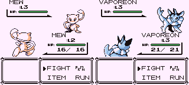

# Pokémon Red and Blue: Restored

This is a disassembly of Pokémon Red and Blue. It has been modified to use the Pokémon back sprites from the Gold and Silver beta versions demoed at Nintendo Space World 1997 to give a look at what Blue could possibly have alternatly looked like.

Credit goes to Rangi, Pia Carrot and Copetin for the improved trainer back sprites of Red and the old man.

It builds the following ROMs:

* pokered.gbc  `md5: e9fdbe135d03ab6adf10efe5e150261b`
* pokeblue.gbc `md5: b132f696d238048a4bc513184f9efcde`

To set up the repository, see [**INSTALL.md**](INSTALL.md).

If you can't build the repository yourself, you can download these BPS patches and apply them to a clean ROM with a tool like [Floating IPS](https://www.smwcentral.net/?p=section&a=details&id=11474).

* [pokered.bps](patches/pokered.bps):  apply to Pokemon Red (UE) [S][!].gb  `md5: 3d45c1ee9abd5738df46d2bdda8b57dc`
* [pokeblue.bps](patches/pokeblue.bps): apply to Pokemon Blue (UE) [S][!].gb `md5: 50927e843568814f7ed45ec4f944bd8b`

## See also

Other hacks:

* [Pokémon Polished Crystal](https://github.com/Rangi42/polishedcrystal)
* [Pokémon Red++](https://github.com/TheFakeMateo/RedPlusPlus/)
* [Pokémon Orange](https://github.com/PiaCarrot/pokeorange)

Discord servers:

* [Rangi](https://discord.gg/ZK5pqK8)
* [Lunaverse](https://discord.gg/SQwkd7r)
* [Pia Carrot](https://discord.gg/UKTyj3t)

pret projects:

* [pokered](https://github.com/pret/pokered)
* [pokegold-spaceworld](https://github.com/pret/pokegold-spaceworld)
* [pokeyellow](https://github.com/pret/pokeyellow)
* [pokecrystal](https://github.com/pret/pokecrystal)

More info:

* [The Cutting Room Floor](https://tcrf.net/Proto:Pok%C3%A9mon_Gold_and_Silver)
